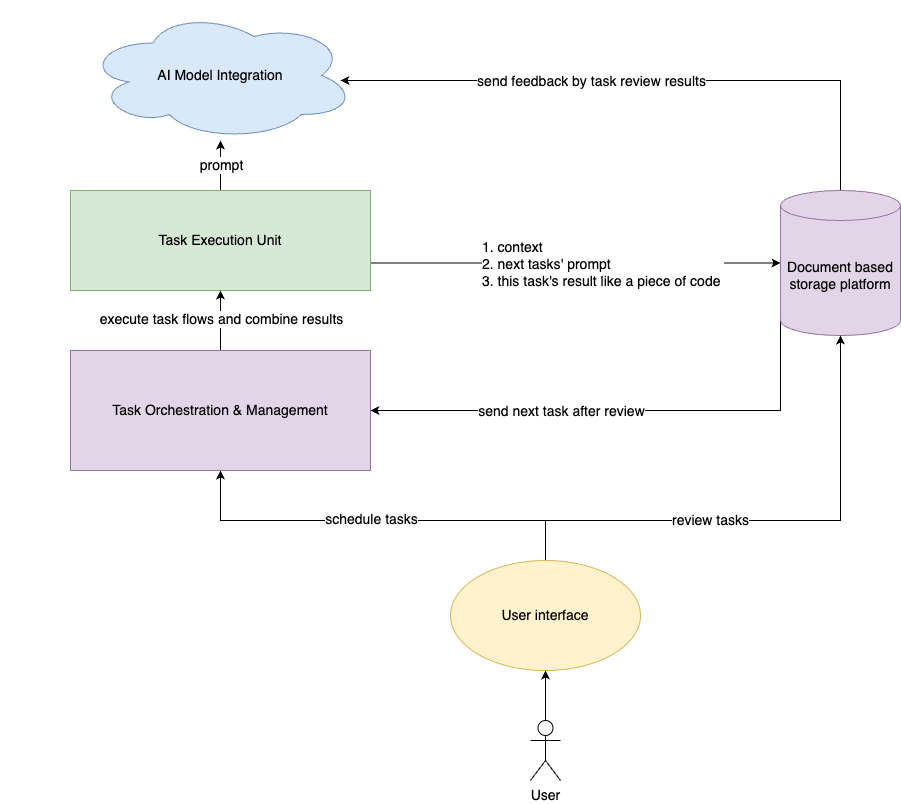
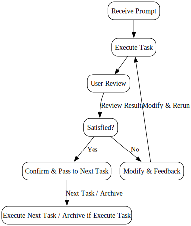

# Welcome to Bot Architect!
[中文文档](README_zh.md)

## Overview
Bot Architect is an innovative platform designed to maximize the potential applications of large language models (LLMs), enabling AI to not only execute specific tasks but also play a central role in project management and organization.

## Core Design
Bot Architect delves into complex project requirements, breaking them down into manageable sub-tasks that are then handled by subsequent AI processes, gradually iterating towards a complete project.

## Key Features
- **Intelligent Task Decomposition**: Automatically breaks down complex projects into smaller, more manageable task units, providing accurate context and prompts.
- **Task Orchestration**: Orchestrates various task flow templates to cater to different types of projects.
- **Context Management**: Provides the precise context information needed for each task's execution.
- **Large Model Integration**: Helps users manage multiple large model accounts within projects, utilizing the comparative strengths of different models for optimal results.
- **Collaboration Platform**: Creates an interface where humans and AI can collaborate effectively, with manual review and modification of AI outputs. Ensures all results are documented and analyzed comprehensively.
- **Results Integration**: Integrates the outcomes of various sub-tasks to form a coherent project output.
- **Feedback and Iteration**: Implements a system for continuous learning from feedback, allowing AI to improve its methodologies and outputs over time.

## Architecture
### Overall

### Task Execution Flow

## Use Cases
- **Software Development**: Covers the entire process from requirement analysis to code implementation.
- **Creative Content Creation**: Manages the entire process from concept ideation to content creation.

## Distinction
What sets Bot Architect apart from other task orchestration platforms is its profound use of AI for project management and task organization. Our platform is more than just an automation tool; it's an intelligent collaborator in project management. AI here doesn't just play the role of an executor but also acts as a director/architect.

## Contribution
We are always looking for innovative minds to join our exploration. Whether you are a developer, a project manager, or an AI enthusiast, there's a place for you at Bot Architect. Here's how you can get involved:
- **Contribute to existing projects**: Check out our [Projects](https://github.com/BotArchitect) page for opportunities to contribute.
- **Join the discussion**: Participate in discussions or start a new conversation on our [Issues](https://github.com/BotArchitect/issues) page.

## Contact Us
If you have any questions or suggestions, please contact us via [GitHub Issues](https://github.com/BotArchitect/issues). We look forward to collaborating with you to advance the Bot Architect project.

## Team Collaboration
The team currently consists of one member. Feel free to reach out for a chat.

Contact email: vandebio1997@gmail.com, preferably after 2 PM Beijing time (UTC+8).

---

Dive into Bot Architect and unlock a new era of AI-assisted project management.
