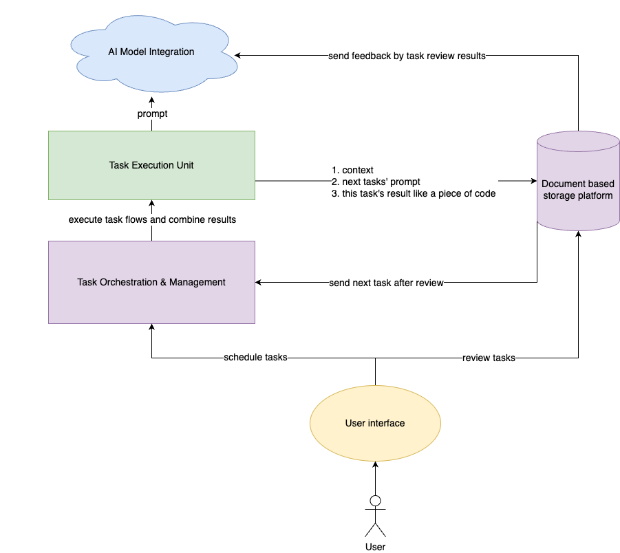
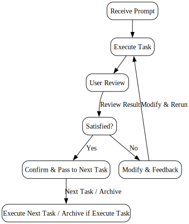

# Welcome to Bot Architect!

## 概述
Bot Architect 是一个创新的平台，旨在最大化大型语言模型（LLM）的应用潜力，让 AI 不仅执行具体任务，还能在项目管理和组织中扮演核心角色。

## 核心设计
Bot Architect 深入解析复杂的项目需求，将其细化为可管理的子任务，并交由下一环节的AI处理，逐步迭代为一个完整的项目。

## 主要功能
- **智能任务分解**：自动将复杂项目分解为更小、明确的任务单元，并给出准确的上下文和prompt。
- **任务编排**：编排不同的任务流模版，以适用于不同类型的项目。
- **上下文管理**：为每项任务提供执行所需的准确上下文信息。
- **大模型集成**：帮助用户在项目中管理多个大模型账号，利用不同模型的相对优势来达到最佳效果。
- **协作平台**：创建人类和AI可以有效协作的界面，可以人工审核并修改AI的执行结果。保证所有的结果都有完整的文档记录与分析。
- **结果整合**：将各子任务成果合理集成，形成完整的项目输出。
- **反馈与迭代：** 实施从反馈中持续学习的系统，使AI能够随着时间的推移改进其方法和输出。

## 架构
### 整体架构

### 任务执行交互流程

## 应用场景
- **软件开发**：涵盖从需求分析到代码实现的完整流程。
- **创意内容制作**：管理从概念构思到内容创作的整个过程。

## 与众不同
与其他任务编排平台相比，Bot Architect 的独特之处在于其深度利用 AI 进行项目管理和任务组织。我们的平台不仅仅是自动化工具，而是项目管理的智能合作伙伴。AI 不光是扮演执行者的角色，也扮演着导演/架构师的角色。

## 贡献
我们始终在寻找创新思维加入我们的探索。无论你是开发者、项目经理还是人工智能爱好者，你在 Bot Architect 都有一席之地。以下是你可以如何参与：
- **对现有项目做出贡献：** 查看我们的[项目](https://github.com/BotArchitect)页面，寻找贡献机会。
- **加入讨论：** 在我们的[议题](https://github.com/BotArchitect/issues)页面参与讨论或开始新的对话。

## 联系我们
如有任何疑问或建议，请通过 [GitHub Issues](https://github.com/BotArchitect/issues) 与我们联系。我们期待与您共同推动 Bot Architect 项目的发展。

## 团队合作
目前团队仅有一人。欢迎来聊。

联系邮箱：vandebio1997@gmail.com ，最好在北京时间下午两点后。

---

探索 Bot Architect，开启 AI 辅助项目管理的新纪元。
